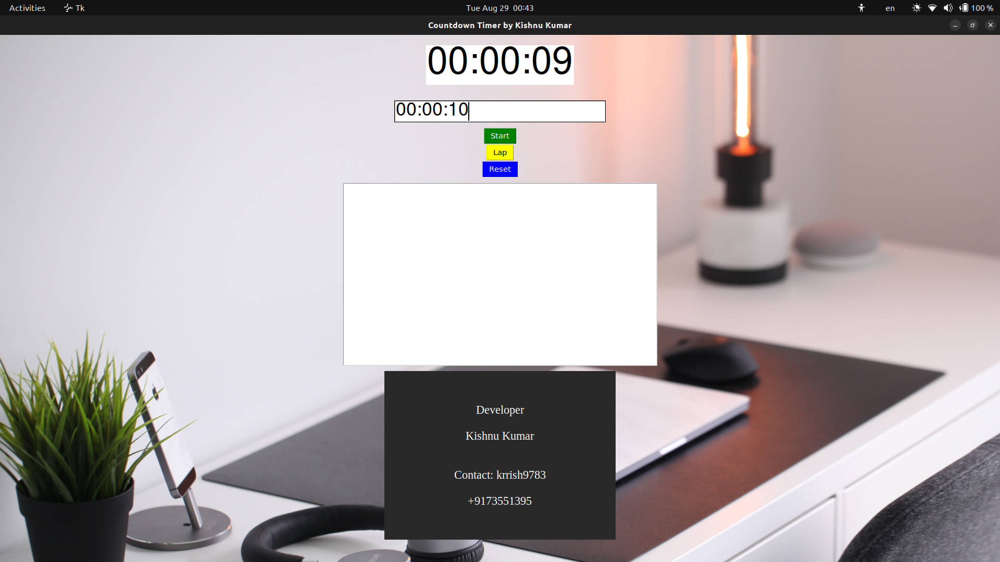

# Countdown Timer with Laps and Alerts

This GitHub project provides a customizable countdown timer implemented in Python, featuring laps functionality and configurable audio notifications for both running time and when the timer reaches zero. This project is designed to be easily used with the PyCharm IDE, but it can also be utilized in other Python development environments.



## Features

- Set a custom countdown time in hours, minutes, and seconds.
- Track and display laps during the countdown.
- Audio notification when each lap is completed.
- Audio notification when the countdown timer reaches zero.
- Compatible with the PyCharm IDE.

## Prerequisites

- Python 3.x
- Required Python libraries (automatically installed if using the provided requirements file):
  - `playsound`: For playing audio notifications.
  - `tkinter`: For manupulating images.

## Installation

1. Clone this repository to your local machine:

   ```bash
   git clone https://github.com/krrish9783/Countdown_Timer.git
Navigate to the project directory:

bash
Copy code
cd Countdown_Timer
Install the required Python libraries using pip:

bash
Copy code
pip install -r requirements.txt
Usage
Open the project in your preferred Python development environment (PyCharm recommended).

Run the Countdown_Time.py script.

Follow the on-screen instructions to set the countdown time in hours, minutes, and seconds.

Click the "Start" Button to begin the countdown.

During the countdown, press the "Laps" Button to record a lap time. The lap time will be displayed, and an audio notification will be played.

When the countdown timer reaches zero, an audio notification will play to alert you.

Customization
You can customize various aspects of the countdown timer:

Sounds: Replace the provided audio files (ticktick.mp3 and timeup.mp3) with your own audio files for different notifications.

Notification Durations: Adjust the duration of the audio notifications by modifying the PLAY_DURATION constants in the Countdown_Timer.py script.

Notification Volume: If the notification sounds are too loud or too quiet, adjust the volume using audio editing software before replacing the audio files.

User Interface: Modify the user interface by editing the print statements in the countdown_timer.py script to match your preferred styling.

Contributions
Contributions to this project are welcome. If you find a bug or have an idea for an enhancement, feel free to open an issue or submit a pull request.

License
This project is licensed under the MIT License.
